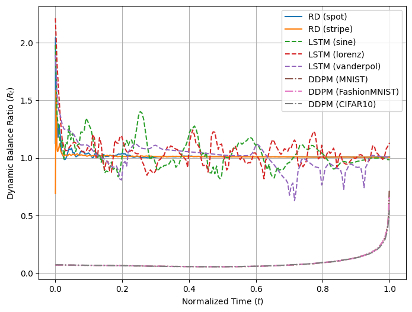
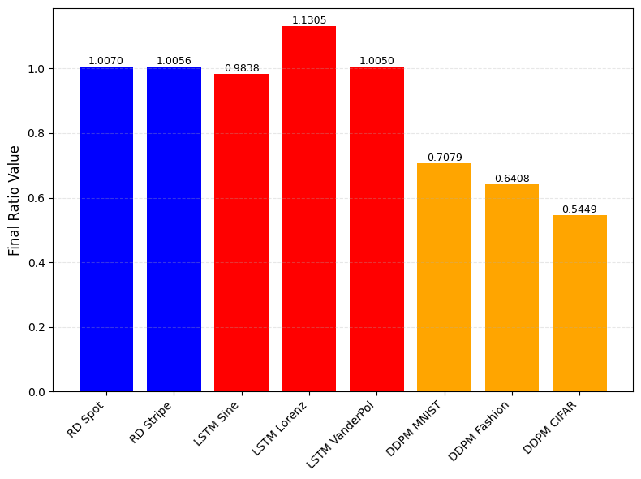

# A Comparative Study of Diffusion Models and Long Short-Term Memory Networks through the Reaction–Diffusion Equation

*This is a Research Project led in the Mathematical Informatics laboratory at Nara Institute of Science and Technology and presented at the AROB-ISCB 2026 conference. Refer to the paper in* `paper/`.

**Abstract:** In this work, we review the similarities between DDPMs and LSTM networks through the Reaction-Diffusion equation. Morphogen concentrations vary depending on a diffusion and a reaction component. The LSTM networks cell-state iterative equation is analogous to this mechanism but in a discrete framework due to its squashing functions. Likewise, DDPMs viewed as continuous-time stochastic differential equations highlight a striking analogy through the presence of both drift and diffusion terms. Hence, a general mathematical equation similar to the Reaction-Diffusion equation can describe the three models. The concept of short-range positive feedback and long-range negative feedback in the Reaction-Diffusion model emphasizes the parallel as well. In LSTM networks, the input gate, which amplifies and stores relevant signals, and the forget gate, which dissipates or suppresses irrelevant information, act as the activator and the inhibitor in the RD model, respectively. In DDPMs, the denoising network provides local positive feedback, restoring structure lost through noise, while the diffusion process applies global negative feedback, spreading and stabilizing information.

**Keywords:** Reaction-Diffusion Equation, Diffusion Models, Long Short-Term Memory Recurrent Neural Networks, Pattern Generation, Feedback

## Introduction

Understanding how complex patterns emerge from simple rules is a central question in both biology and artificial intelligence. In biological systems, Alan Turing’s Reaction–Diffusion (RD) model provides an explanation for spontaneous pattern formation. It describes how interacting chemical substances, an activator and an inhibitor, diffuse through space and react locally, generating stable spatial patterns such as stripes, spots, or waves. This interaction between local activation and global inhibition has since been recognized as a general mechanism for self-organization in living systems. In parallel, modern machine learning models have revealed similar dynamics in artificial systems. Long Short-Term Memory (LSTM) networks are a class of recurrent neural architectures designed to model temporal sequences and retain information over long time series data. They achieve this by regulating how past states influence future predictions, allowing them to capture both short-term and long-term dependencies in dynamic data. In a similar perspective, Denoising Diffusion Probabilistic Models (DDPMs) construct structured data from random noise through an iterative denoising process that progressively reverses a stochastic Gaussian noise diffusion. Although all these frameworks are used in different disciplines, they share a common mathematical foundation: the dynamic balance between growth and decay, reaction and diffusion. Investigating these parallels provides an understanding of pattern formation, stability, and feedback control in both natural and artificial systems. However, the literature lacks a formal mathematical framework linking these two machine learning models. Existing studies rarely examine how the internal dynamics of artificial neural networks can be interpreted using concepts from biological Reaction–Diffusion systems. This absence leaves unexplored a potentially rich analogy between biological self-organization and artificial memory regulation.

## Background

### Reaction-Diffusion Systems
Reaction-Diffusion systems are a theoretical model used to explain self-regulated pattern formation in biology. More specifically in the classical Turing framework, the activator $\textbf{u}$ and the inhibitor $\textbf{v}$ are two interacting morphogens that obey the partial differential equations in Eq. (1). They diffuse and react with each other so that their concentration can form stable spatial patterns such as stripes, spots, or waves.

$$
\begin{align}
    \partial_t \textbf{u} &=& D_u \nabla^2 \textbf{u} + R_u(\textbf{u},\textbf{v})\\
    \partial_t \textbf{v} &=& D_v \nabla^2 \textbf{v} + R_v(\textbf{u},\textbf{v})\\
\end{align}
$$
where $D_u$ and $D_v$ are the diffusion coefficients and $R_u$ and $R_v$ are the functions that describe the local reactions between $\textbf{u}$ and $\textbf{v}$. The Reaction-Diffusion equation is a sum of a diffusion term and a reaction term.

A central mechanism underlying pattern formation in Reaction-Diffusion systems is the combination of short-range positive feedback from the activator and long-range negative feedback from the inhibitor.

Short-range positive feedback allows the activator to enhance its own production  and diffuse slowly over a local neighborhood in the spatial domain. Hence, $R_u$ increases when $\textbf{u}$ increases. In other words, a small local increase in a quantity causes more of itself to be produced nearby. Because the activator diffuses slowly, it remains concentrated in small regions, enabling these regions to “stand out” from their surroundings. Even a tiny fluctuation in activator concentration can grow locally, producing the seeds of a pattern.

In contrast, long-range negative feedback acts globally. It is implemented by the second morphogen, the inhibitor, whose role is to suppress and counteract the activator. The inhibitor diffuses much faster and spreads its effect over a global spatial domain. The inhibitor rapidly propagates in order to prevent the activator from forming a uniform concentration everywhere.

The combination creates patterns only if the inhibitor diffuses faster, i.e. $D_v > D_u$.

### Long Short-Term Memory Networks
Long Short-Term Memory networks (LSTMs) are recurrent neural networks designed to preserve information over long temporal horizons and overcome the Vanishing Gradient Problem. LSTMs achieve this through gates and the cell state $(\mathbf{C}_t)_t$, a component that retains and forgets information to capture long-term dependencies at each time step. On the other hand, the hidden state $(\mathbf{h}_t)_t$ describes the short-term memory and the main output of one LSTM cell for the current time step. Both states are computed using sigmoid $\sigma$ and hyperbolic tangent $\tanh$ to map proportions. The principle of LSTMs relies on Eqs. (2) to (7) alongside Fig. 1.

The forget gate $(\mathbf{f}_t)_t$ in Eq. (2) determines what information to discard from the cell state at time $t-1$. This decision is made according to the new input $\mathbf{x}_t$ and previous short-term memory hidden state $\mathbf{h}_{t-1}$. This mechanism maps the inhibition of the cell state.
$$
\begin{align}
    \mathbf{f}_t &=& \sigma(\mathbf{W}_f \mathbf{x}_t + \mathbf{U}_f \mathbf{h}_{t-1}+ \mathbf{b}_f)
\end{align}
$$

The input gate $(\mathbf{i}_t)_t$ determines what new information to store in the cell state with respect to Eqs. (3) and (4). This gate is processed in two parts : sigmoid to decide which information to update in $\mathbf{C}_t$ and the candidate cell state $\tilde{\mathbf{C}}_t$ that acts as the new information and amplification.
$$
\begin{align}
    \mathbf{i}_t &=& \sigma(\mathbf{W}_i \mathbf{x}_t + \mathbf{U}_i \mathbf{h}_{t-1} + \mathbf{b}_i)\\
    \tilde{\mathbf{C}}_t &=& \tanh(\mathbf{W}_C \mathbf{x}_t + \mathbf{U}_C \mathbf{h}_{t-1} + \mathbf{b}_C)
\end{align}
$$

The critical equation where the dynamic balance occurs is Eq. (5), the cell state update. It combines the previous cell state, the selection of information to forget, and the selection of information to add and update.
$$
\begin{align}
    \mathbf{C}_t &=& \mathbf{f}_t \odot \mathbf{C}_{t-1} + \mathbf{i}_t \odot \tilde{\mathbf{C}}_t
\end{align}
$$

Finally, the output gate $(\mathbf{o}_t)_t$ determines what part of the new cell state at time $t$ and outputs the next hidden state as the short-term memory in Eqs. (6) and (7).
$$
\begin{align}
    \mathbf{o}_t &=& \sigma(\mathbf{W}_o \mathbf{x}_t + \mathbf{U}_o \mathbf{h}_{t-1} + \mathbf{b}_o)\\
    \mathbf{h}_t &=& \mathbf{o}_t \odot \tanh(\mathbf{C}_t)
\end{align}
$$

The matrices $\mathbf{W}_f, \mathbf{W}_i, \mathbf{W}_C, \mathbf{W}_o$ and $\mathbf{U}_f, \mathbf{U}_i, \mathbf{U}_C, \mathbf{U}_o$ represent the weight parameters of the LSTM, while the vectors $\mathbf{b}_f, \mathbf{b}_i, \mathbf{b}_C, \mathbf{b}_o$ are the bias parameters. The operator $\odot$ is the Hadamard product.

The cell state structure directly mirrors the Reaction-Diffusion mechanism in a discrete form: the $\mathbf{f}_t \odot \mathbf{C}_{t-1}$ term acts as the long-range inhibition and controls stability, while the $\mathbf{i}_t \odot \tilde{\mathbf{C}}_t$ term acts as the local reaction that shows growth.

### Denoising Diffusion Probabilistic Models

Denoising Diffusion Probabilistic Models learn to construct data by reversing a noisy diffusion process. This framework fundamentally relies on a forward diffusion process and a reverse denoising process.\\

The forward diffusion process adds Gaussian noise in $T$ time steps in order to transform a data sample $\mathbf{x}_0$ into pure noise $\mathbf{x}_T$. Each successive data is given by Eq. (8).
$$
\begin{align}
    \mathbf{x}_{t+1} = \sqrt{1-\beta_t}\mathbf{x}_t + \sqrt{\beta_t}\mathbf{\epsilon_t}
\end{align}
$$
where $\beta_t$ is the noise schedule that decreases with time and $\mathbf{\epsilon_t} \sim \mathcal{N}(\mathbf{\epsilon_t}|0,\mathbf{Id})$ is the noise at time $t$.

This process can be modeled as a Markov chain following the distribution $q(\mathbf{x}_t|\mathbf{x}_{t-1}) = \mathcal{N}(\mathbf{x}_t; \sqrt{1-\beta_t}\mathbf{x}_{t-1}, \beta_t\mathbf{Id})$.

The reverse denoising process is the generative part of the model which learns to reverse the forward process from $\mathbf{x}_T$ to $\mathbf{x}_0$. This process can also be approximated by a Gaussian law if the noise schedule is small. Thus, the reverse process can be modeled by the distribution  $p(\mathbf{x}_{t-1}|\mathbf{x}_{t},\mathbf{w}) = \mathcal{N}(\mathbf{x}_{t-1}; \mathbf{\mu}(\mathbf{x}_{t-1}, \mathbf{w}, t), \beta_t\mathbf{Id})$ where $\mathbf{\mu}(\mathbf{x}, \mathbf{w},t)$ is a deep neural network governed by the set of parameters $\mathbf{w}$.

The crucial point of DDPMs for this work is the view of such models through the lens of Continuous-Time Stochastic Partial Equations (SDEs) that highlights a deterministic drift term in $\mathbf{dt}$ and a stochastic diffusion term in $\mathbf{dw}$. The forward process corresponding SDE is shown in Eq. (9), while the reverse process SDE is given in Eq. (10).
$$
\begin{align}
    \mathbf{dx} &=& \underbrace{f(\mathbf{x},\mathbf{t}) \mathbf{dt}}_{\text{drift}} + \underbrace{g(\mathbf{t})\mathbf{dw}}_{\text{diffusion}}\\
    \mathbf{dx} &=& [\underbrace{f(\mathbf{x},\mathbf{t}) - g^2(\mathbf{t}) \nabla_{\mathrm{x}} \ln p(\mathbf{x})] \mathbf{dt}}_{\text{drift}}  + \underbrace{g(\mathbf{t})\mathbf{d\bar{w}}}_{\text{diffusion}}
\end{align}
$$
where $\nabla_{\mathrm{x}} \ln p(\mathbf{x})$ is the score function, $\mathbf{w}$ a standard Brownian motion, and $\mathbf{\bar{w}}$ its inverse in time. The score function $\nabla_{\mathrm{x}} \ln p(\mathbf{x})$ is approximated by the denoising neural network $\epsilon_{\theta}$ during training.

Both the forward and reverse DDPM processes are now expressed in the canonical form of an SDE, which is structurally identical to the Reaction-Diffusion equation when viewed as a dynamic system. Iteratively, the diffused noise is reversed by a learning denoising drift function.

## The Reaction-Diffusion Principle as a Unifying Analogy

In this section, we map the components of the biological RD model to the gate mechanisms of LSTMs and the stochastic differential equations of DDPMs under qualitative hypotheses and assumptions.

### Discrete Activation and Forgetting

In the Reaction-Diffusion model, the concentration of morphogens evolves over continuous space and time. Using Eq. (11) instead of Eq. (5) highlights the mapping from biology to the LSTM networks.
$$
\begin{align}
    \mathbf{C}_t - \mathbf{C}_{t-1} = \underbrace{-(1 - \mathbf{f}_t) \odot \mathbf{C}_{t-1}}_{\text{diffusion}} + \underbrace{\mathbf{i}_t \odot \tilde{\mathbf{C}}_t}_{\text{reaction}}
\end{align}
$$

In an LSTM, in contract to the RD model, the time is discrete. Despite this discretization, the update rule for the LSTM cell state mirrors the Reaction-Diffusion dynamic. If we look at Eq. (11), we can identify the term $-(1-\mathbf{f}_t) \odot \mathbf{C}_{t-1}$ as the diffusion component that puts in recurrence the cell state, while the term $\mathbf{i}_t \odot \tilde{\mathbf{C}}_t$ can be viewed as the reaction component. Hence, two hypotheses are made :

- The input gate and its activation coefficient $\mathbf{i}_t$ act as the activator of the system and allow reaction. In LSTM, the input gate $\mathbf{i}_t$ selectively amplifies the new signal $\tilde{\mathbf{C}}_t$, by injecting "mass" into the cell state for the next time step. This creates short-range positive feedback, allowing specific patterns to grow within the memory representation, analogous to the autocatalysis of the activator in Turing's model. For any data, it would restore the structure and patterns. This statement is stronger for periodic data due to periodicity in Turing patterns.
- The forget gate and its forget coefficient $\mathbf{f}_t$ act as the inhibitor and allow diffusion. By multiplying the previous state by a factor $\mathbf{f}_t \in [0, 1]^h$, the network applies a decay force. This is functionally equivalent to the diffusion of the inhibitor in RD. Just as the inhibitor prevents the activator from saturating the entire domain, the forget gate prevents the cell state from saturating with irrelevant information and selects the information to keep from the past, ensuring stability over long temporal sequences and creating long-range negative feedback on the cell state.

### Stochastic Drift and Noise Spreading

The analogy is most explicit in DDPMs when viewed through the lens of Continuous-Time Stochastic Differential Equations. The reverse generative process is defined by its stochastic diffusion term and its drift term that can be directly mapped as a diffusion and a reaction component similar to RD models. Once again, we make the following hypothesis based on qualitative assumptions :

- The learned drift term $[f(\mathbf{x},t) - g^2(t) \nabla_{\mathrm{x}} \ln p(\mathbf{x})]\mathbf{dt}$, specifically the score function approximation $\nabla_{\mathbf{x}} \ln p(\mathbf{x})$ parameterized by $\epsilon_\theta$, acts as the reaction component and the activator. Geometrically, this term represents a gradient field pointing towards the modes of the data distribution. It functions as a restorative force, actively pushing the chaotic state $\mathbf{x}_t$ towards the structured data manifold and performs a short-range positive feedback from learning to generate images. This mirrors the role of the activator in Turing patterns, which drives the local concentration of chemical substances to form the core of a pattern.
- The term $g(\mathbf{t})d\mathbf{\bar{w}}$ introduces stochastic diffusion. In the absence of this term, the reverse process would reduce to an Ordinary Differential Equation (ODE) performing deterministic gradient ascent, likely causing the system to collapse into a single, dominant mode regardless of the starting noise. The injection of noise using Brownian motion adds randomness to the generation and acts as a dispersive force, analogous to the inhibitor in biological systems. Just as rapid diffusion prevents the activator from saturating the spatial domain, the stochastic term in DDPMs prevents the drift from overfitting to a single solution, ensuring the generation of diverse, stable, and robust patterns.

## Experiments

To empirically validate the theoretical mapping proposed in the previous section, a comparative experiment is designed to measure the internal dynamics of "Reaction" and "Diffusion" across the three distinct architectures.

A primary challenge in this comparative study is the dimensional mismatch between systems : RD models operate on chemical concentrations, LSTMs on abstract hidden states and 1D sequences, and DDPMs on pixel intensities. Direct comparison of raw values is therefore impossible. To resolve this, we propose a dimensionless metric based on component magnitude ratios.

### Models

- **Reaction-Diffusion** : We employ the Gray-Scott model, a canonical RD system known for generating complex Turing patterns. The system simulates the interaction of two chemical substances $\mathbf{u}$ and $\mathbf{v}$ on a 2D grid with periodic boundary conditions. In this model, the reaction functions for the activator and the inhibitor become, respectively, $R_u(\mathbf{u, \mathbf{v}}) = - \mathbf{u}^2 \mathbf{v} + F(1 - \mathbf{u})$ and $R_v(\mathbf{u, \mathbf{v}}) =  \mathbf{u}^2 \mathbf{v} - (F + k)\mathbf{v}$ where $\mathbf{F}$ is the feed rate and $\mathbf{k}$ is the kill rate. We will take a feed rate in $\mathbf{F} \in [0.029, 0.055]$ and a constant kill rate $\mathbf{k}=0.062$ with diffusion coefficients $D_u = 1 \times 10^{-5}$ and $D_v = 0.5 \times 10^{-5}$. A feed rate of $0.029$ defines spot patterns, while $0.055$ will produce stripes. 
- **LSTM** : We implement a standard single-layer LSTM using the Eqs (2) to (7) with dimension $\mathbf{d}=1$ input feature and $\mathbf{h}=16$ hidden features. First of all, the network is trained on a simple sinusoidal waves dataset generated with a constant sequence length $\mathbf{s}=200$ with random frequency and phase and learns to reproduce the curve shape of the waves from a given sequence. In the training we minimize the mean-squared error between the actual signal and the predicted signal output by the model at each time step. To add robustness to this study, the LSTM is also trained on a "chaos" dataset generated from one equation of the Lorenz Attractor system and another dataset based on the Van der Pol oscillator generated in dimension 1.
- **DDPM** : We utilize a standard DDPM architecture with a U-Net model for the denoising/learned drift function $\epsilon_\theta$. The model is trained on the MNIST dataset and learns to reverse a Gaussian diffusion process to construct structured digit images from pure noise. The model is trained to minimize the variational lower bound on the negative log-likelihood, approximated by the simple mean-squared error between predicted and actual noise: $||\epsilon - \epsilon_\theta(\mathbf{x}_t, t)||^2$. Additional trainings on the FashionMNIST dataset and CIFAR10 dataset are done to see if the results are reproducible and robust.

### The Reaction Metric $\mathcal{M}_{\mathrm{react}}$

To quantify the magnitude of the term responsible for creating, restoring, or amplifying patterns or data structures, we compute the L2 norm of the identified reaction component in each model and take the mean :
$$
\begin{align}
    \mathcal{M}_{\mathrm{react}}^{\mathrm{RD}} &=& \frac{1}{T} \sum_{\mathbf{t}=1}^T || \mathbf{u}_t \mathbf{v}_t^2 - (F+k)\mathbf{v}_t ||_2\\
    \mathcal{M}_{\mathrm{react}}^{\mathrm{LSTM}} &=& \frac{1}{T} \sum_{\mathbf{t}=1}^T || \mathbf{i}_t \odot \tilde{\mathbf{C}}_t  ||_2\\
    \mathcal{M}_{\mathrm{react}}^{\mathrm{DDPM}} &=& \frac{1}{T} \sum_{\mathbf{t}=1}^T || \epsilon_\theta(\mathbf{x}_t, t) ||_2
\end{align}
$$
where $T$ is the total time length used for pattern generation depending on the model, and $\epsilon_\theta$ designs the learned drift.

\subsection{The Diffusion Metric $\mathcal{M}_{\mathrm{diff}}$}

Here, we measure the magnitude of the term responsible for spreading, decaying, or randomizing the pattern by using the same process as the reaction metric :
$$\begin{align}
    \mathcal{M}_{\mathrm{diff}}^{\mathrm{RD}} &=& \frac{1}{T} \sum_{\mathbf{t}=1}^T || D_v \nabla^2\mathbf{v}_t ||_2\\
    \mathcal{M}_{\mathrm{diff}}^{\mathrm{LSTM}} &=& \frac{1}{T} \sum_{\mathbf{t}=1}^T || (1 - \mathbf{f}_t) \odot \mathbf{C}_{t-1} ||_2\\
    \mathcal{M}_{\mathrm{diff}}^{\mathrm{DDPM}} &=& \frac{1}{T} \sum_{\mathbf{t}=1}^T || | \sigma_{\mathbf{t}} \mathbf{z}  ||_2
\end{align}$$
where $\sigma_t \mathbf{z}$ designs the diffused noise.

### Mean Dynamic Balance Ratio
By defining both metrics as magnitudes of update vectors, their ratio becomes dimensionless and directly comparable across domains and defines the Mean Dynamic Balance Ratio :
$$\begin{align}
    R = \frac{\mathcal{M}_{\mathrm{react}}}{\mathcal{M}_{\mathrm{diff}}}
\end{align}$$

The Mean Dynamic Balance Ratio takes values into $[0,+\infty[$. We admit hypothetically that complex and stable pattern formation requires $R \approx 1$, and such a value defines the equilibrium baseline of Reaction-Diffusion mechanism.

If $R \ll 1$, the diffusion force is much stronger than the reaction force. The system smooths out differences faster than they can be created and leads to homogeneity in the patterns. In LSTM, it corresponds to vanishing gradient, and the signal will converge to zero. In DDPM, the generated image will remain pure noise with no structure. On the contrary, if $R \gg 1$, the reaction force dominates and the systems amplify every small fluctuation. It leads to a single solution and cannot adapt to new patterns or data.

## Experimental Results

For each model and for each set of parameters or training, the magnitudes for reaction and diffusion are computed. Table 1  presents the Mean Dynamic Balance Ratio that describes the overall stability between reaction and diffusion across the total time $T$. In Fig. 2, we plot the Dynamic Balance Ratio over a normalized time $t\in [0,1]$ for each model that is defined in Eq. (20). 
$$\begin{align}
    \mathcal{M}_{\mathbf{i}} &=& \frac{1}{T} \sum_{\mathbf{t}=1}^T \mathcal{M}_{\mathbf{i},\mathbf{t}}\\
    R_{\mathbf{t}} &=& \mathcal{M_{\text{react,}\mathbf{t}}}/ \mathcal{M_{\text{react,}\mathbf{t}}}
\end{align}$$

Reaction-Diffusion models achieve a ratio of approximately $1.00 \pm 0.03$ as expected on both spot and stripe regimes. This RD ratio confirms that Turing pattern formation requires the constructive reaction force to counter the dispersive diffusion force. Hence, a value of $R=1$ corresponds to a perfect stability. This observation is even more relevant as in Fig. 2, the Dynamic Balance Ratio (orange and blue lines) starts with transient fluctuations and spikes but rapidly converges to $1.0$. It shows a static stability reached : once the Turing instability creates the patterns, the local concentration of the activator reaches a steady state where its production exactly matches its diffusion to the surroundings.

LSTM networks also achieve good results for each dataset, and the performance is close to the RD model ratio value. The slight difference between each dataset is explained by the complexity of the different systems used to generate sets of sequences for the training. Sine waves are deterministic, while the Lorenz and Van der Pol systems introduce "chaos" into the trajectories. The structure of gates in LSTM shows an active regulation between forgotten input and new input in Fig. 2 (green, red, and purple dashed lines).

|      | Parameters/Dataset | $\mathcal{M}_{\mathrm{react}}$ | $\mathcal{M}_{\mathrm{diff}}$ | $R$    |
|------|--------------------|--------------------------------|-------------------------------|--------|
| RD   | Spot Regime        | 0.3589                         | 0.3551                        | 1.0107 |
| RD   | Stripe Regime      | 0.3742                         | 0.3707                        | 1.0093 |
| LSTM | Sine Waves         | 1.6732                         | 1.6204                        | 1.0325 |
| LSTM | Lorenz System      | 1.5836                         | 1.5254                        | 1.0381 |
| LSTM | Van der Pol        | 1.8933                         | 1.9791                        | 0.9566 |
| DDPM | MNIST              | 0.2143                         | 3.0274                        | 0.0708 |
| DDPM | FashionMNIST       | 0.2152                         | 3.0277                        | 0.0711 |
| DDPM | CIFAR10            | 0.3688                         | 5.2508                        | 0.0702 |

Unlike the flat converged line of RD, the LSTM ratio constantly oscillates around the equilibrium at $R=1$. The peaks at $R>1$ and the increasing parts of the ratio correspond to the moments where the input gate encodes new information to the network, while the valleys at $R<1$ and decreasing parts correspond to the stable periods where the forget gate erases selected past information. These observations emphasize the assumption of the interplay between input and forget gates that respectively play the role of reaction and diffusion in Reaction-Diffusion systems.

*Fig. 1. Dynamic Balance Ratio over time*

In contrast and despite the hypothesis done previously, DDPMs trained on MNIST, FashionMNIST, and CIFAR10 show poor results with a ratio significantly inferior to 1. In this case, the overall magnitude of the diffused noise is approximately 14 times stronger compared to the magnitude of the learned drift.  As Table 1 shows the overall Dynamic Balance Ratio, it is more interesting to look at each time step of the ratio. Fig. 2 reveals a striking phase transition behavior of the DDPM between reaction and diffusion (brown, pink, and gray dashdot lines). For $t=0$ to $t=0.8$, the ratio remains extremely low and is dominated by noise : it describes the moments where the generated structure is still governed by noise and no pattern is visible. However, as $t \rightarrow 1$, the ratio increases significantly and rapidly approaches the equilibrium $R=1$. This result is expected as DDPMs do not maintain structure but emerge with a new one from pure noise. At the final time step for every dataset, the DDPM value of the ratio approaches the equilibrium. More complex images require larger time steps to generate. Hence, the final ratio in Fig. 3 for CIFAR10 is lower compared to MNIST. Finally, the sharp rise of the ratio at the end represents the emergence of fine details in the structure, moving the system from an entropic regime towards the balanced regime found in RD and LSTM. 

*Fig. 2 Final value of the Dynamic Balance Ratio*

The values of the ratio for DDPMs being lower than the equilibrium can be explained by the lack of training of the models and not enough time steps used for the image generations.

## Conclusion

Our analysis demonstrates that the Turing Reaction-Diffusion principle is a universal lens for understanding the dynamics in LSTM networks and DDPMs, but it manifests in three distinct modes. Reaction-Diffusion models show static stability to create patterns. The forces of activation and inhibition converge to a steady state, locking the system into fixed spatial patterns. LSTM networks exhibit dynamic stability to create sequences by oscillating around the equilibrium ratio. The networks alternate between reactive encoding and diffusive inhibition from their gate mechanism. DDPMs manifest phase transition to create structured and detailed images from pure noise. However, some hardware limitations led the results of DDPMs to be inaccurate of the theoretical assumptions. Theoretically, a DDPM reverse process is governed by the diffused noise on the one hand and then the learned drift replaces it to make a detailed image emerging. Hence the Dynamic Balance Ratio of DDPMs is an increasing and monotonic function.